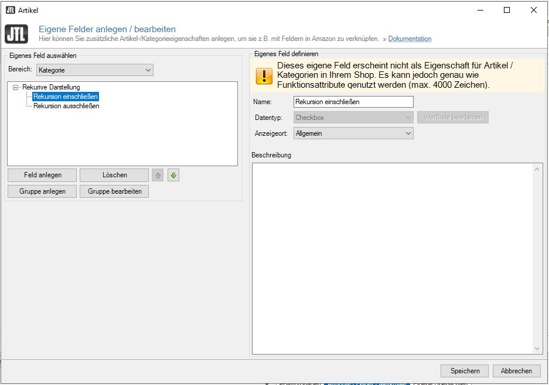

# Rekursivlisting von Fluxel für JTL-Shop

[Download](https://github.com/fluxel-app/fluxel_rekursivliste/releases/download/v1/fluxel_rekursivliste.zip)

Kompatibilität: JTL-Shop 5 oder höher

Diese Plugin zieht Ihre Artikel in die Oberkategorien des JTL-Shops.

## JTL-Wawi / Vorbereitung

Für die Funktion des Plugins werden zwei Funktionsattribute oder eigene Felder benötigt, die exakt folgendermaßen heißen müssen:

- Rekursion einschließen
- Rekursion ausschließen

Empfohlen wird als Datentyp die Checkbox.

Hier eine Beispielkonfiguration:

## Rekursion einschließen

Wenn das Feld gesetzt ist, werden Artikel aus den Unterkategorien in der Kategorie angezeigt.

## Rekursion ausschließen

Ist das Feld gesetzt ist, werden Artikel dieser Kategorie und der Unterkategorien nicht in den oberen Kategorien angezeigt.

## Bespiel:

- Kategorie 1 (Rekursion einschließen)
  - Kategorie 1.1
    - Artikel 1
  - Kategorie 1.2
    - Artikel 2
    - Artikel 3
    - Artikel 4
    - Kategorie 1.2.1 (Rekursion ausschließen)
      - Artikel 5
      - Artikel 6
      - Kategorie 1.2.1.1
        - Artikel 7

In dem Beispiel werden in Kategorie 1 Artikel 1 - 4 angezeigt.

## Status und Sicherheit

Das Plugin baut eine Liste auf Kategorie-Schlüssel zusammen und modifiziert die Bedingungen für die Artikelauswahl. Die Kategorie-Schlüssel werden in den Objekt-Cache geschrieben und haben somit nach der ersten Aufwahl keinen Einfluss auf deine Shop-Performance.
